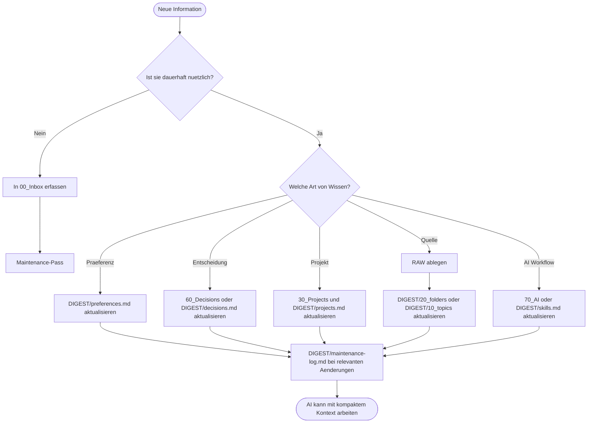

# MasterBrain Setup

MasterBrain ist eine lokale, AI-unterstuetzte Obsidian-Vault fuer dauerhaftes Arbeitswissen. Die Vault liegt lokal unter `~/.MasterBrain` und ist als private Arbeitsumgebung gedacht: schnelle Notizen, Entscheidungen, Projekte, Quellen, AI-Workflows und kompakte DIGEST-Dateien leben an einem Ort.

Die Idee ist einfach: Menschen navigieren ueber Obsidian und `Home.md`; AI-Assistenten starten ueber `DIGEST/00_catalog.md` und laden danach nur den kleinsten relevanten Kontext.

## Worauf Das Setup Basiert

| Baustein | Rolle im Setup |
|---|---|
| Obsidian | Lokale Markdown-Wissensbasis mit Wikilinks, Properties, Bases und Canvas. |
| VS Code | Arbeitsumgebung fuer Markdown, GitHub Copilot, Agent-Instructions und optional gespeicherte Workspaces. |
| GitHub Copilot | Nutzt `.github/copilot-instructions.md` als Einstieg und folgt dann `AGENTS.md`. |
| Claude Code | Nutzt `CLAUDE.md` als Einstieg und folgt ebenfalls `AGENTS.md`. |
| DIGEST/RAW-Modell | DIGEST enthaelt kompaktes AI-Kontextwissen, RAW enthaelt Originalquellen nur bei Bedarf. |
| MCP oder Obsidian CLI | Optionaler, eingeschraenkter Tool-Zugriff, damit andere Workspaces MasterBrain nutzen koennen, ohne die Vault direkt zu oeffnen. |

## Zentrale Dateien

| Datei oder Ordner | Zweck |
|---|---|
| `Home.md` | Menschlicher Startpunkt in Obsidian. |
| `AGENTS.md` | Gemeinsame Regeln fuer AI-Agenten in dieser Vault. |
| `CLAUDE.md` | Claude-Code-spezifischer Einstieg. |
| `.github/copilot-instructions.md` | GitHub-Copilot-spezifischer Einstieg. |
| `DIGEST/00_catalog.md` | Erster Kontextpunkt fuer AI-Assistenten. |
| `DIGEST/preferences.md` | Dauerhafte Arbeits- und Stilpraeferenzen. |
| `DIGEST/decisions.md` | Dauerhafte Entscheidungen und ihre Begruendung. |
| `DIGEST/projects.md` | Aktive Projekte und naechste Schritte. |
| `DIGEST/skills.md` | Verfuegbare AI-Skills und Workflows. |
| `DIGEST/maintenance-log.md` | Wartungshistorie, offene Punkte und Follow-ups. |
| `00_Inbox/` | Schnelle, unsortierte Captures. |
| `RAW/` | Originalquellen, nur bei Bedarf lesen. |
| `LOCAL/` | Lokale/private Arbeitsdetails, nicht fuer Vorlagen oder Export gedacht. |

## Arbeitsworkflow



## Daily Flow

1. Starte in `Home.md` oder `DIGEST/00_catalog.md`.
2. Erfasse spontane Gedanken in `00_Inbox/`.
3. Verschiebe dauerhaftes Wissen in den passenden Bereich: Projekte, Entscheidungen, Ressourcen, AI-Workflows oder DIGEST.
4. Aktualisiere den passenden DIGEST-Eintrag, sobald AI-Assistenten das Wissen spaeter wiederverwenden sollen.
5. Lege Originalmaterial in `RAW/` ab und fasse nur die stabile Essenz in DIGEST zusammen.
6. Fuehre nach groesseren Sessions oder regelmaessig den Maintenance-Workflow aus.

## AI Workflow

Wenn ein AI-Assistent in dieser Vault arbeitet, gilt diese Reihenfolge:

1. Gemeinsame Regeln aus `AGENTS.md` lesen.
2. Tool-spezifischen Einstieg beachten: `.github/copilot-instructions.md` fuer GitHub Copilot, `CLAUDE.md` fuer Claude Code.
3. `DIGEST/00_catalog.md` als Kontext-Router verwenden.
4. Nur die kleinste relevante DIGEST-Datei laden.
5. `RAW/` oder `LOCAL/` nur oeffnen, wenn konkrete Detailquellen noetig sind.
6. Dauerhafte Erkenntnisse in bestehende Notes oder DIGEST-Dateien einarbeiten.
7. Relevante Pflegeaktionen in `DIGEST/maintenance-log.md` festhalten.

## Maintenance Workflow

Nutze Maintenance, wenn du neue Quellen hinzufuegst, viele Notizen verschiebst, AI-Regeln aenderst oder die Vault laenger gewachsen ist.

Standardablauf:

1. `DIGEST/00_catalog.md` lesen.
2. `00_Inbox/` pruefen und sortieren.
3. `DIGEST/preferences.md`, `DIGEST/decisions.md`, `DIGEST/projects.md` und `DIGEST/skills.md` aktualisieren.
4. Topic- und Folder-Digests bei geaenderten Quellen aktualisieren.
5. Stale, doppelte oder widerspruechliche Notizen markieren.
6. Private oder sensitive Inhalte nicht in oeffentliche Vorlagen, Prompts, Agents oder Skills kopieren.
7. `DIGEST/maintenance-log.md` aktualisieren.

## Die `.code-workspace` Geschichte

Eine `.code-workspace` Datei ist eine gespeicherte VS-Code-Workspace-Konfiguration. Sie kann Ordner, Workspace-Settings, empfohlene Extensions, Tasks und Debug-Konfigurationen zusammenhalten. Fuer MasterBrain gibt es zwei sinnvolle Varianten.

### Variante 1: Vault Direkt Oeffnen

Fuer die normale Arbeit reicht es, die Vault als Ordner zu oeffnen:

```powershell
code "$HOME\.MasterBrain"
```

Das ist simpel und nutzt `.vscode/settings.json` direkt aus der Vault.

### Variante 2: Gespeicherte Workspace-Datei

Wenn du ein stabiles VS-Code-Fenster mit Namen, empfohlenen Extensions oder spaeter mehreren lokalen Ordnern willst, kannst du eine lokale `MasterBrain.code-workspace` Datei verwenden.

Minimalbeispiel, wenn die Datei im Vault-Root liegt:

```json
{
  "folders": [
    {
      "name": "MasterBrain",
      "path": "."
    }
  ],
  "extensions": {
    "recommendations": [
      "GitHub.copilot",
      "GitHub.copilot-chat"
    ]
  }
}
```

Wichtig: Wenn eine `.code-workspace` absolute Pfade, private Projektordner oder maschinenspezifische Einstellungen enthaelt, bleibt sie lokal. Fuer eine wiederverwendbare Vorlage nur relative Pfade oder Platzhalter wie `<PROJECT_NAME>` verwenden.

### Weitere Ordner Zum Workspace Hinzufuegen

Eine `.code-workspace` Datei kann mehrere Ordner gleichzeitig oeffnen. Das ist nuetzlich, wenn MasterBrain neben einem weiteren lokalen Arbeitsordner liegen soll, ohne dass dessen Inhalte in die Vault kopiert werden. Ein typisches Beispiel ist eine SharePoint-Dokumentbibliothek, die ueber OneDrive mit dem lokalen `C:` Drive synchronisiert wird.

Beispiel fuer eine lokale Workspace-Datei:

```json
{
  "folders": [
    {
      "name": "MasterBrain",
      "path": "."
    },
    {
      "name": "SharePoint Projektunterlagen",
      "path": "C:\\Users\\<USER>\\OneDrive - <ORGANISATION>\\<SHAREPOINT_BIBLIOTHEK>"
    }
  ],
  "extensions": {
    "recommendations": [
      "GitHub.copilot",
      "GitHub.copilot-chat"
    ]
  }
}
```

Diese Variante ist praktisch fuer lokale Arbeit mit synchronisierten Dokumenten, aber sie ist bewusst eine lokale Konfiguration. Absolute OneDrive-, SharePoint- oder Projektpfade gehoeren nicht in eine oeffentliche Vorlage. Fuer eine teilbare Version Platzhalter verwenden oder den zweiten Ordner ganz weglassen.

### Cross-Workspace Nutzung

MasterBrain soll nicht in jeden Projekt-Workspace als Ordner eingefuegt werden. Besser ist ein eingeschraenkter Tool-Adapter, etwa MCP-Filesystem oder Obsidian CLI, der nur Zugriff auf die MasterBrain-Vault erlaubt. Das reduziert Kontextlaerm und verhindert, dass private Vault-Inhalte versehentlich mit Projektdateien vermischt werden.

## Sicherheitsregeln

- Keine rohen Secrets, Passwoerter, Tokens, Private Keys, Connection Strings oder Recovery Codes speichern.
- Private oder vertrauliche Inhalte bleiben lokal in der Vault.
- `LOCAL/` und sensitive Quellen nicht in oeffentliche Vorlagen oder geteilte Artefakte kopieren.
- Fuer wiederverwendbare Beispiele Platzhalter nutzen: `<PROJECT_NAME>`, `<PERSON_NAME>`, `<INTERNAL_URL>`, `<SECRET_NAME>`.
- Vor Loeschen, Pruning, Publishing, Export oder Ueberschreiben der Vault explizit bestaetigen lassen.

## Lernressourcen

| Thema | Ressource |
|---|---|
| VS Code Workspaces | [What is a VS Code workspace?](https://code.visualstudio.com/docs/editing/workspaces/workspaces) |
| VS Code Settings | [User and workspace settings](https://code.visualstudio.com/docs/configure/settings) |
| VS Code AI Customization | [Customize AI in Visual Studio Code](https://code.visualstudio.com/docs/copilot/copilot-customization) |
| GitHub Copilot Instructions | [Adding repository custom instructions for GitHub Copilot](https://docs.github.com/en/copilot/how-tos/configure-custom-instructions/add-repository-instructions) |
| Copilot Customization Concepts | [About customizing GitHub Copilot responses](https://docs.github.com/en/copilot/concepts/about-customizing-github-copilot-chat-responses) |
| Obsidian Markdown | [Obsidian Flavored Markdown](https://help.obsidian.md/obsidian-flavored-markdown) |
| Obsidian Properties | [Properties](https://help.obsidian.md/properties) |
| Obsidian Links | [Internal links](https://help.obsidian.md/links) |
| Mermaid Diagramme | [About Mermaid](https://mermaid.js.org/intro/) |
| Model Context Protocol | [What is MCP?](https://modelcontextprotocol.io/introduction) |

## Faustregel

Schreibe fuer Menschen in Notes, fuer AI in DIGEST, und bewahre Originalquellen in RAW auf. Wenn etwas spaeter wichtig sein wird, mache es auffindbar, kurz und sicher.

## Obsidian Plugins

https://community.obsidian.md/search?type=plugin 

### OneNote
https://obsidian.md/help/import/onenote => https://obsidian.md/help/plugins/importer

### E-Mails
https://chatgpt.com/share/6a0c2213-4a60-83eb-b6e2-a1b7ba71ce04 

### Weitere
- https://community.obsidian.md/plugins/portals
- https://community.obsidian.md/plugins/semantic-vault-mcp
- https://community.obsidian.md/plugins/tasks-map
- https://community.obsidian.md/plugins/mediaviewer
- https://community.obsidian.md/plugins/default-template
- https://community.obsidian.md/plugins/note-gallery
- https://community.obsidian.md/plugins/base-board
- https://community.obsidian.md/plugins/block-view

Schon konfiguriert:
- https://community.obsidian.md/plugins/vcf-contacts
- https://community.obsidian.md/plugins/url-into-selection
- https://community.obsidian.md/plugins/pdf-plus
- https://community.obsidian.md/plugins/obsidian-advanced-uri
- https://community.obsidian.md/plugins/obsidian-excalidraw-plugin
- https://community.obsidian.md/plugins/github-copilot
- https://community.obsidian.md/plugins/fast-text-color
- https://community.obsidian.md/plugins/data-files-editor
- https://community.obsidian.md/plugins/colored-tags-wrangler
- https://community.obsidian.md/plugins/omnisearch

- https://community.obsidian.md/plugins/obsidian-tasks-plugin